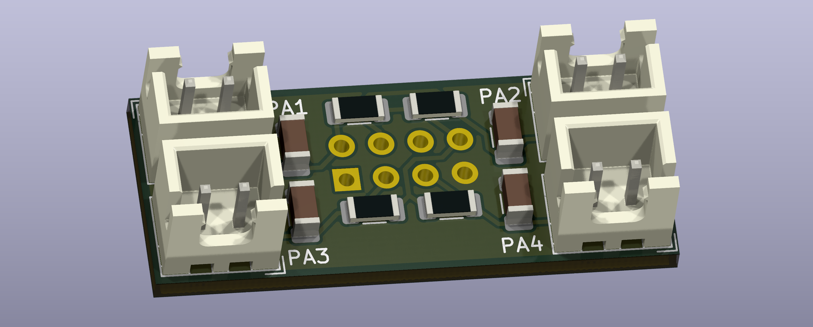

# NyoomiesKME TH Expander
An expander board for the [Nyoomies](https://github.com/comradef191/NyoomiesKME) klipper motor expansion.

# BOM
1. 4x 1206 2.2k 1% resistor
2. 4x 1206 10uF capacitor
3. 4x JST-SH 2pin socket
4. 1x 2.54mm 2x4pin socket

# Klipper configuration
See the [example configuration](nyoomies-th-expander.cfg) for reference.

# Schematic
